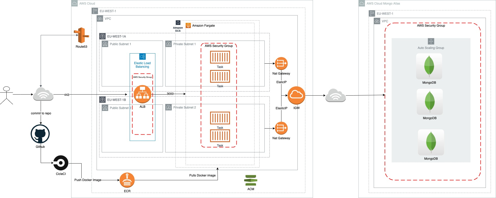

# go-rest-api
go-rest-api is a basic golang restful api that connects to a mongo database exposing the following endpoints

PUT /hello/<username>
Get /hello/<username>

## Tech Stack
* Golang 
* Mongodb
* Docker
* Terraform

## Prerequisites
The following tools will need to be available in order to build and run locally:
* GO [GO](https://golang.org/dl/)
* Docker [Docker](https://www.docker.com/get-started)
* Docker-Compose [Docker-Compose](https://docs.docker.com/compose/install/)
* Terraform v0.12.13 [Terraform](https://www.terraform.io/downloads.html)
* Make

For Provisioning and CI / CD
You will need create an account with the following services
* CircleCi [CircleCi](https://circleci.com/signup/)
** Setup Circle to be able to build your github project
* Mongo Atlas [MongoAtlas](https://cloud.mongodb.com/user#/atlas/register/accountProfile)
** Create an organisation
** Create API Public key and Private key
* Amazon Web Services [AWS](https://aws.amazon.com/)
** Create a user and save aws_access_key_id and aws_secret_access_key in `~/.aws/credentials` with privileges to run the `prereq` terraform
** Create a Hosted Zone in Route 53
* Docker Hub [DockerHub](https://hub.docker.com/)
** Register for a User and Repository (used for backup registry)

## Getting started
Clone `go-rest-api` repo and `cd` into the repo root
   ```bash
     git clone https://github.com/Fay3/go-rest-api.git
   ```

### docker-compose
To Start the application locally via docker-compose run
   ```bash
     make build-local
   ```

To Remove the application locally via docker-compose run
   ```bash
     make remove-local
   ```
this will build and launch the go-rest-api in a docker container and connect to a mongodb docker container and will be exposed on localhost port 3000 http://localhost:3000

### local-development
#### Run
To Run the application locally in the root of the git repo:

1. Start a detached Mongodb docker container locally 
   ```bash
     docker run -d -p 27017-27019:27017-27019 mongo:latest
   ```
2. Export the following Environment Variable
   ```bash
     export DB_URI="mongodb://localhost:27017"
   ```
3. Start application without building 
   ```bash
     go run api-app/main.go
   ```

#### Test
To Test the application locally in the root of the git repo:

#### Build
To Build the application locally in the root of the git repo
   ```bash
     make build-app
   ```
this will build the go application and place the binary in the directory `bin/`

## Continuous Integration / Delivery
for CI/CD we will be using circle ci the config file for circle can be found in `.circleci/config.yml`

once a user push a commit to github this will automatically fire off the pipeline jobs which will include:
* lint: 
** will lint the docker image
* test: 
** run unit test against code
* build: (will only run if lint and test passes)
** build the dockerfile
** run container structured test against build
** save docker build as tar files for dockerhub and ECR registry with git commit shar as tag
* push: <Will Only Run On Master Branch> 
** Assumes AWS Role `CIASSUMEROLE-` and loads docker build .tar files from previous build job and pushes to dockerhub and ECR registry
* plan: <Will Only Run On Master Branch>
** Assumes AWS Role `CIASSUMEROLE-` with working directory of `terraform/environment/prod` This will run a terraform plan and output the plan to file `tfplan`
approve_plan: <Will Only Run On Master Branch>
** A deploy gate that requires manually approval to proceed to next job `deploy`
deploy: Assumes AWS Role `CIASSUMEROLE-` loads tfplan file from previous job `plan` and runs terraform apply which will either provision below Architecture (if on first run) or deploy new docker tag via task to AWS fargate.

### Prerequisites for Circle pipeline
#### IAM USER, ROLE, S3 BUCKETS and ECR REPO
1. Prerequisites Terraform State File
* Create an aws `s3` bucket to store the `prereq` state file

2. Create The AWS User, Role and S3 Buckets for Terraform statefile 
2.1 edit `terraform/prereq/provider.tf` file replace `bucket` with the one created in step 1
   ```replace
     terraform {
        backend "s3" {
        bucket = "stevenquan-terraform"
   ```
2.3 Assuming that you have your `aws_access_key_id` and `aws_secret_access_key` setup in `~/.aws/credentials and you are in the root of the git repo run:
   ```bash
     cd terraform/prereq && terraform init && terraform apply 
   ```
Accept the changes by typing `yes` The above command will create an IAM user and Role for CI, S3 bucket for logging and a S3 bucket for the app terraform state file

after the above has been created grab / create the aws_access_key_id and aws_access_key for the `ci-svc-user` by login into the aws console and then going to IAM

also grab the arn for the `CIASSUMEROLE-` role, `ECR url`, `ECR repo` that was created

#### CIRCLE CI ENVIRONMENT VARIABLES
you will need to create the following environment variables in the circle ci project
* AWS_ACCESS_KEY_ID - aws_access_key_id for ci-svc-user created in CricleCi Prerequisites
* AWS_SECRET_ACCESS_KEY - aws_access_key_id for ci-svc-user created in CricleCi Prerequisites
* AWS_ASSUME_ROLE_ARN - the arn for the role `CIASSUMEROLE-` created in CricleCi Prerequisites
* AWS_ACCOUNT_ID - AWS ACCOUNT ID
* DOCKER_PASSWORD - created in Project Prerequisites
* DOCKER_USERNAME - created in Project Prerequisites
* ECR_REGISTRY_URL
* ECR_REPO
* MONGO_ATLAS_ORG_ID - created in Project Prerequisites
* MONGO_ATLAS_PIR - created in Project Prerequisites
* MONGO_ATLAS_PUB - created in Project Prerequisites
* MONGO_DB_PASS - database password to be used for production APP
* ROUTE53_HOSTED_ZONE - created in Project Prerequisites

CircleCI Should now be able to build the project with no errors

## Deployment

Ideally we should be using the pipeline to do our deployments but should you need to do this locally

1. Export the Terraform environment variables
   ```bash
        export TF_VAR_aws_account_id=<replace_with_your_aws_account_id>
        export TF_VAR_route53_hosted_zone=<replace_with_your_aws_route53_hosted_zone>
        export TF_VAR_mongodbatlas_private_key=<replace_with_your_mongodb_atlas_private_key>
        export TF_VAR_mongodbatlas_public_key=<replace_with_your_mongodb_atlas_public_key>
        export TF_VAR_mongo_password=<replace_with_your_mongodb_password_to_be_used>
        export TF_VAR_mongo_org_id=<replace_with_your_mongodb_atlas_org_id>
   ```

2. Terraform init and Terraform apply `cd` `terraform/environment/prod/`
   ```bash
        terraform init
        terraform apply
   ```
   review terraform plan and accept changes with `yes` to deploy

## Architecture Diagram



AWS Infrastructure
* VPC
* Internet Gateway
* 2x NatGateways
* 2x Elastic IP
* 4x Route Tables
* 1x Private subnet zone a
* 1x Private subnet zone b
* 1x Public subnet zone a
* 1x Public subnet zone b
* 2x Security Groups
* 1x ALB (ACM Certifcate, Route53 Entry)
* 1x Target Group
* 1x ECS Service 
* 4x ECS FARGATE Task

Mongo Atlas
* VPC
* 3x MongoDB

## Considerations

### CRUD
* Although not specified I have included POST and DELETE functions in application be not exposed
* After reading the rfc7231#section-4.3.4 in considering POST is not exposed if the username does not exist the user will be created

### CND
Dependant on how many expect hits consideration of implementation of CDN such as aws cloudfront for GET request to improve response times 

### DR Environment
When hosting an application in production a DR environment should be considered
* cold standby environment in another AWS Region and switch using DNS
* upgrade mongo atlas cluster to regional

### Mongo Atlas
Mongodb Atlas was decided due to the simplicity of hosting a Mongodb Cluster and ease of not having to manage the cluster

### SRE
* S3 Logs with a dedicated bucket S3 Log bucket
* ALB Access logs to S3 bucket 
* VPC Flow Logs to S3 bucket
* Cloudwatch log group for ECS Fargate Task

## Limitations
Authentication on the API END Points was not implemented due to time constraints but would be recommended

## Roadmap
Authentication via API Keys for end points


